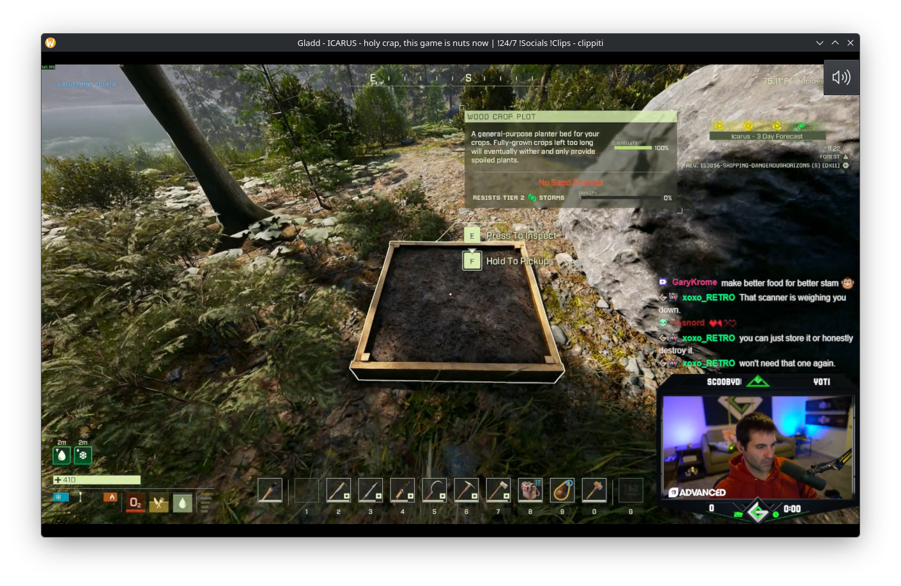
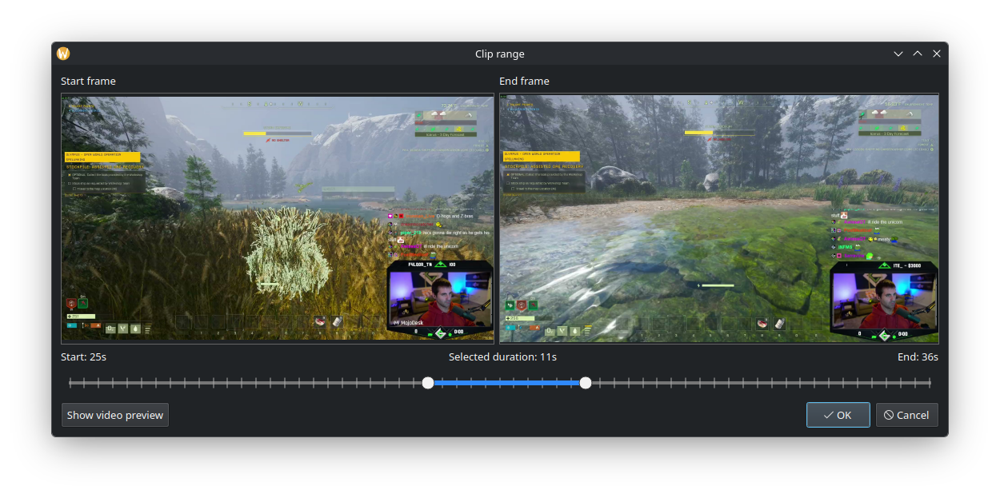
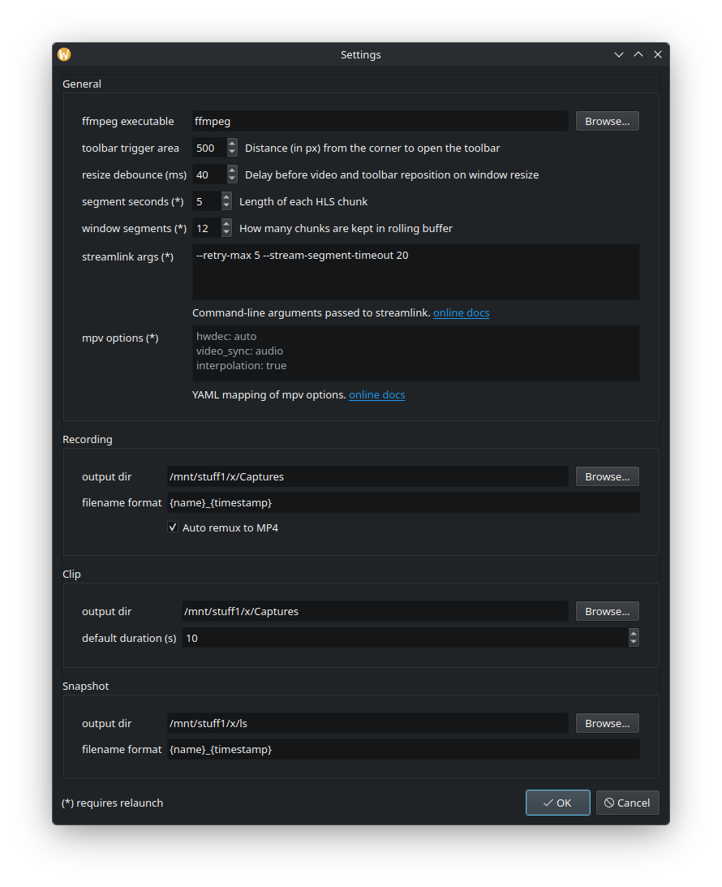

# Clippiti
*Single-stream live player with rolling buffer, clipping, and recording.*

Clippiti is a PyQt6 desktop app that opens a live stream through Streamlink, keeps a rolling local buffer, and lets you export clips or recordings without leaving the player.

## Features

- Live stream playback via Streamlink + mpv
- Rolling HLS buffer pipeline (Streamlink -> ffmpeg)
- Clip export from buffered timeline
- Recording with optional auto-remux to MP4
- Floating controls, keyboard shortcuts, and OSD feedback
- YAML config with runtime-editable settings dialog
- CLI overrides for Streamlink and mpv options

Supported OS: Linux, Windows, macOS

## Requirements

- Python 3.12+
- `streamlink` installed and available in `PATH`
- `ffmpeg` installed and available in `PATH` (or configured path)
- Desktop environment that supports PyQt6 apps

## Install

From source (recommended for now):

```bash
git clone <your-repo-url>
cd clippiti
python3 -m venv .venv
source .venv/bin/activate
pip install -r requirements.txt
pip install -e .
```

Run:

```bash
clippiti <url> <quality>
```

Alternative without editable install:

```bash
PYTHONPATH=src ./.venv/bin/python -m clippiti <url> <quality>
```

## Command-line options

```text
positional:
  url                      Stream URL to open
  quality                  Desired stream quality

optional:
  --sl TEXT                Pass-through Streamlink arguments string
  --mpv TEXT               Additional mpv options (YAML or key=value)
  --config PATH            Path to config YAML file
  --workdir PATH           Path to runtime working directory
  --verbose                Enable verbose startup logs
```

Example:

```bash
clippiti https://www.twitch.tv/example_channel best --sl "--retry-max 5" --mpv "vf=hflip"
```

## Configuration

Clippiti stores configuration in YAML.

Resolution order:

1. `--config <path>` if provided
2. User config location (`clippiti.yaml`) if it exists
3. `<workdir>/config.yaml` if it exists
4. Fallback to `<workdir>/config.yaml` (or `./clippiti.yaml` if no workdir)

User config location (`clippiti.yaml`) is typically:

- Linux: `~/.config/clippiti.yaml`
- Windows: `%APPDATA%\clippiti.yaml`
- macOS: `~/Library/Application Support/clippiti.yaml`

Default workdir is:

- `/tmp/clippiti`

## Development

Install dev/test deps (already included in `requirements.txt`):

```bash
source .venv/bin/activate
pip install -r requirements.txt
```

Run tests:

```bash
PYTHONPATH=src ./.venv/bin/python -m pytest -q
```

## Documentation

- [Technical documentation index](doc/README.md)

## Troubleshooting

- Stream metadata probe fails:
  - Verify URL is online/public
  - Verify `streamlink` is installed and runnable
- Playback pipeline does not start:
  - Verify `ffmpeg` is installed and reachable
  - Use `--verbose` to inspect startup logs
- mpv/video issues:
  - Verify `python-mpv` is installed
  - Try with simpler `--mpv` options first

## License

MIT License - see `LICENSE` if present in this repository.

## Acknowledgments

- Streamlink
- ffmpeg
- PyQt6
- python-mpv

## Screenshots




