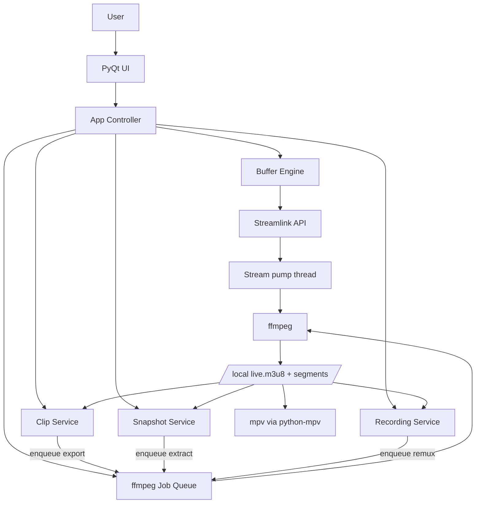
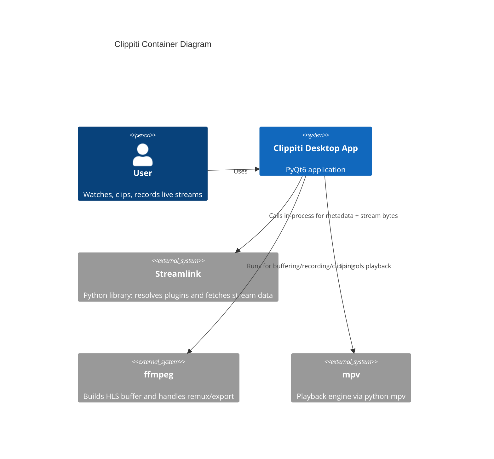

# Architecture Overview

Clippiti is a desktop application built with PyQt6 and python-mpv.
It uses the Streamlink Python API and ffmpeg to build a local rolling HLS buffer, then plays the local playlist through mpv.

## High-Level Structure

## C4-Style Container View

## Key Design Choices

- Startup is asynchronous so the window can open while pipeline initialization is in progress.
- The stream processing path is explicit: Streamlink API stream -> pump thread -> ffmpeg stdin -> HLS output -> local playlist.
- Clipping and recording are service-driven and isolated from UI widgets.
- Snapshots are extracted from the buffered segments via ffmpeg (not mpv screenshots), so saved images keep correct colors and are rotated to match the viewer.
- Post-processing (clip export, recording remux, snapshot extraction) goes through a single shared ffmpeg job queue, so ffmpeg processes never overlap and are controlled from one place.

## Core Runtime Artifacts

- Session directory: `<workdir>/sessions/<session_id>/`
- Live playlist: `<session_dir>/live.m3u8`
- HLS segments: `<session_dir>/seg_*.ts`
- Optional stderr logs per process when debug logging is enabled.
