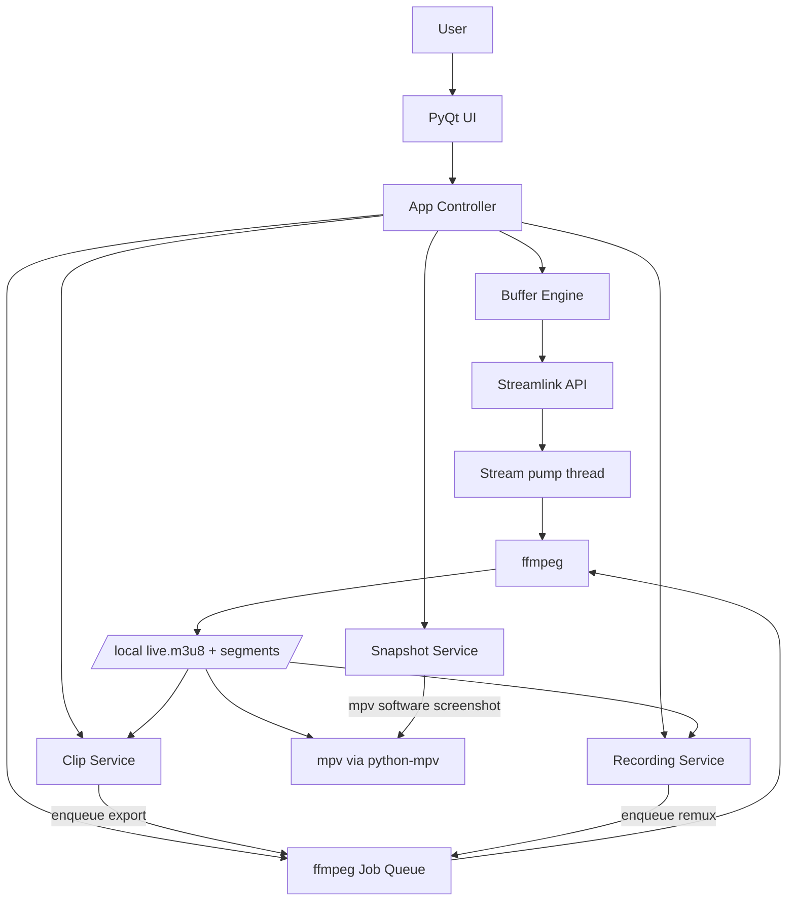
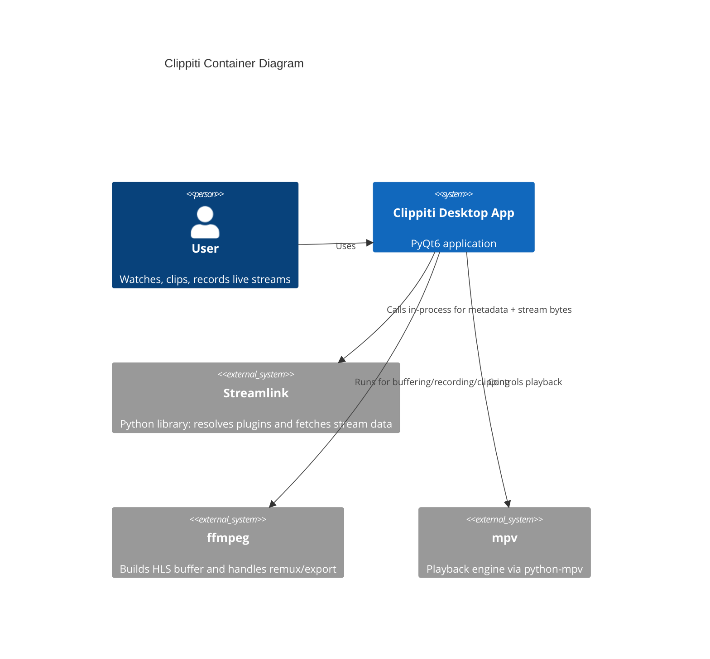

# Architecture Overview

Clippiti is a desktop application built with PyQt6 and python-mpv.
It uses the Streamlink Python API and ffmpeg to build a local rolling HLS buffer, then plays the local playlist through mpv.

## High-Level Structure

## C4-Style Container View

## Key Design Choices

- Startup is asynchronous so the window can open while pipeline initialization is in progress.
- The stream processing path is explicit: Streamlink API stream -> pump thread -> ffmpeg stdin -> HLS output -> local playlist.
- Clipping and recording are service-driven and isolated from UI widgets.
- A single `AppContext` (see `app_context.py`) holds the singleton services and shared session state and is passed to the workflow controllers; live player state (mute/rotation) is delegated to the video surface via a `PlayerControls` protocol so there is one source of truth.
- Clip and recording flows are extracted into `ClipWorkflow` / `RecordingWorkflow` controllers that take the context and emit Qt signals (OSD messages, mute, recording state); `MainWindow` subscribes and renders. Services and widgets never receive UI callbacks.
- Snapshots are taken with mpv's own software screenshot (`screenshot-sw`, so colors stay correct under the libmpv render VO), written to a temp file, rotated with Pillow to match the viewer's rotation (the software screenshot ignores `video-rotate`), then moved to the output dir. Playback stays hardware-decoded and GPU-rendered.
- Post-processing for clips and recordings (export/remux) goes through a single shared ffmpeg job queue, so those ffmpeg processes never overlap and are controlled from one place. Snapshots do not use the queue (mpv writes the image directly).

## Core Runtime Artifacts

- Session directory: `<workdir>/sessions/<session_id>/`
- Live playlist: `<session_dir>/live.m3u8`
- HLS segments: `<session_dir>/seg_*.ts`
- Optional stderr logs per process when debug logging is enabled.
