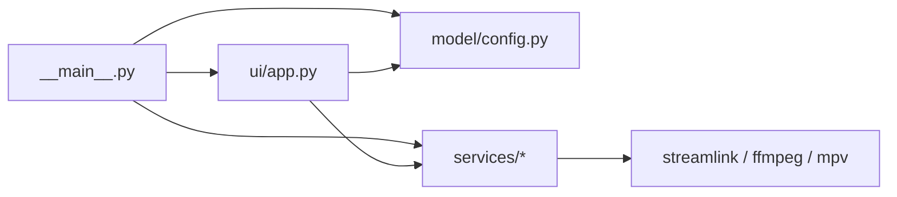

# Module Reference

## Entry and Composition

- `src/clippiti/__main__.py`
- Responsibilities:
  - CLI parsing
  - config loading/saving
  - metadata probing
  - startup pipeline creation
  - final teardown/cleanup

## Model Layer

- `src/clippiti/model/config.py`
- Responsibilities:
  - default config
  - normalization
  - config path resolution
  - output directory expansion/creation

## Services Layer

- `src/clippiti/services/streamlink_args.py`
  - Streamlink args parse/merge/build helpers.
- `src/clippiti/services/mpv_args.py`
  - mpv options parse/filter/merge with force/allow/block behavior.
- `src/clippiti/services/buffer_engine.py`
  - metadata probe and live HLS pipeline lifecycle.
- `src/clippiti/services/clipper.py`
  - stage preparation, preview frame extraction, clip export job creation.
- `src/clippiti/services/recording.py`
  - recording start/stop/finalize and async stop worker.
- `src/clippiti/services/remux_queue.py`
  - queued ffmpeg process execution and completion signaling.

## UI Layer

- `src/clippiti/ui/app.py`
  - main window orchestration and service wiring.
- `src/clippiti/ui/video_surface.py`
  - mpv OpenGL render surface.
- `src/clippiti/ui/control_strip.py`
  - floating controls and action state.
- `src/clippiti/ui/clip_dialog.py`
  - clip range and preview dialog.
- `src/clippiti/ui/settings_dialog.py`
  - runtime-editable settings dialog.
- `src/clippiti/ui/osd.py`
  - on-screen status overlay.

## Dependency Direction

