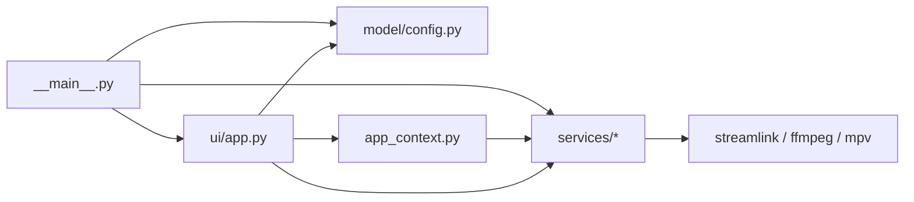

# Module Reference

## Entry and Composition

- `src/clippiti/__main__.py`
- Responsibilities:
  - CLI parsing
  - config loading/saving
  - stream resolution (Streamlink API)
  - startup pipeline creation
  - final teardown/cleanup

## Model Layer

- `src/clippiti/model/config.py`
- Responsibilities:
  - default config
  - normalization
  - config path resolution
  - output directory expansion/creation

## Application Context

- `src/clippiti/app_context.py`
  - `AppContext`: the single container for the singleton services (remux queue, recording, snapshot), config-scoped collaborators (clip/recording configs and services), and session-scoped state (current runtime, recording rotation). Exposes delegated live player state (`muted`, `rotation`) through the `PlayerControls` protocol. Built by `ui/app.py` and passed to the workflow controllers.

## Services Layer

- `src/clippiti/services/slsession.py`
  - In-process Streamlink session, argument parsing (via Streamlink's own CLI parser), URL/quality resolution, metadata, and the stream-to-ffmpeg pump.
- `src/clippiti/services/mpvargs.py`
  - mpv options parse/filter/merge with force/allow/block behavior.
- `src/clippiti/services/buffer.py`
  - live HLS pipeline lifecycle (opens the Streamlink stream, spawns ffmpeg, pumps bytes); owns the `SessionRuntime` value object.
- `src/clippiti/services/clipper.py`
  - clip stage preparation, preview frame extraction, and clip export job creation.
- `src/clippiti/services/snapshot.py`
  - saves the current on-screen frame via mpv's software screenshot to a temp file, rotates it (Pillow) to match the viewer's rotation, then moves it to the output dir. Async: the screenshot runs via `command_async` (a synchronous one deadlocks the libmpv render API).
- `src/clippiti/services/recording.py`
  - recording start/stop/finalize and the async stop worker.
- `src/clippiti/services/remuxer.py`
  - the single shared queued ffmpeg process executor and completion signaling (used by clip export and recording remux).
- `src/clippiti/services/favicons.py`
  - Qt-free favicon fetch-and-cache for the stream's site icon.

## UI Layer

- `src/clippiti/ui/app.py`
  - main window and composition root: builds the `AppContext`, wires services, workflow controllers, and widgets, and owns the OSD.
- `src/clippiti/ui/video.py`
  - mpv OpenGL render surface; owns live player state (mute/volume/rotation/flip).
- `src/clippiti/ui/toolbar.py`
  - floating controls and action state.
- `src/clippiti/ui/clipper.py`
  - `ClipWorkflow` controller plus the clip range/preview dialog.
- `src/clippiti/ui/recorder.py`
  - `RecordingWorkflow` controller: recording start/stop and the post-stop container/remux decision.
- `src/clippiti/ui/settings.py`
  - runtime-editable settings dialog.
- `src/clippiti/ui/osd.py`
  - on-screen status overlay.

## Dependency Direction

