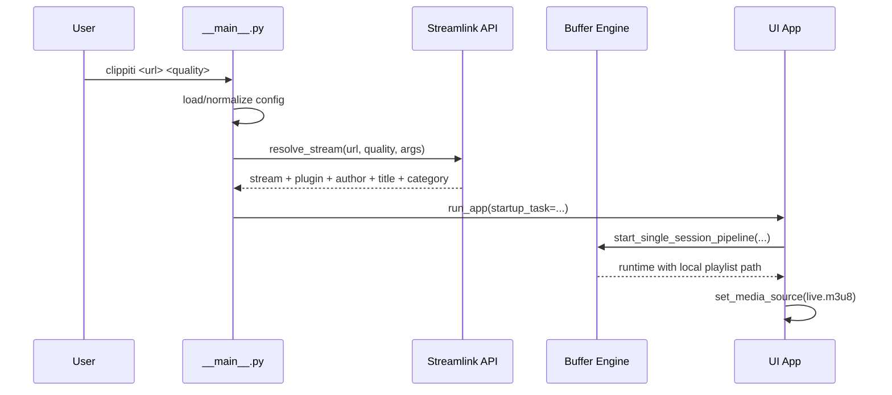
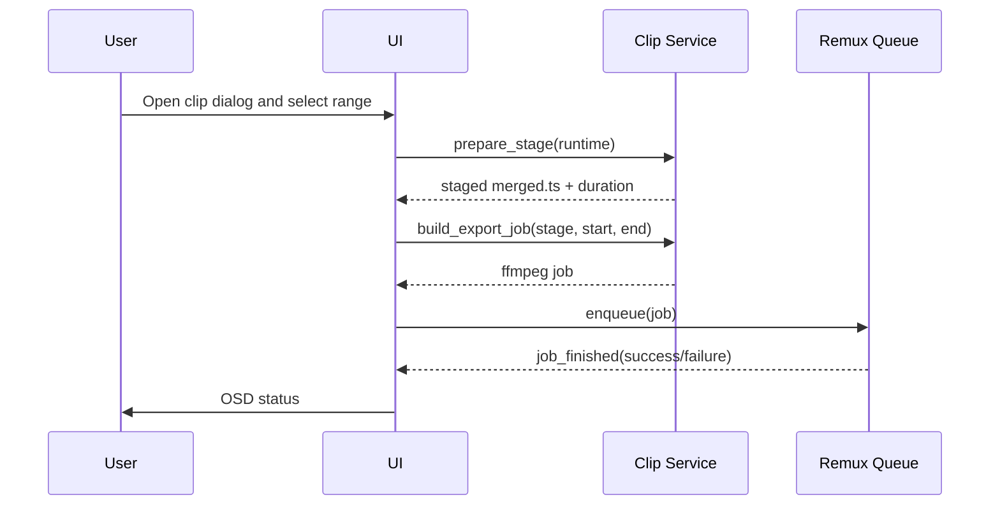
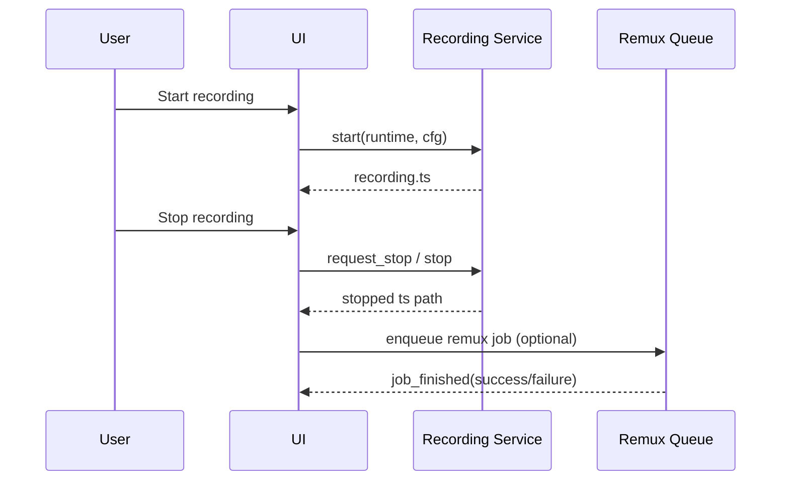
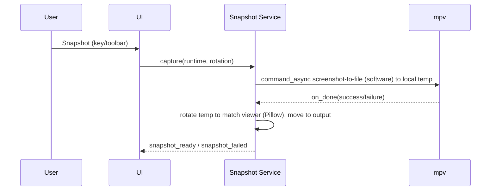
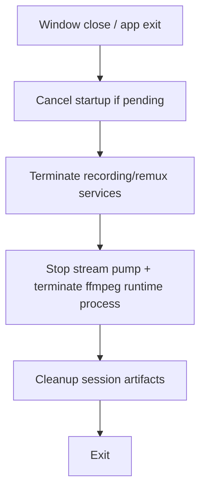

# Runtime Workflows

This document summarizes the main application workflows.

## 1. Startup and Playback

## 2. Clip Export

## 3. Recording and Optional Remux

Rotation is blocked while recording. If the view was rotated before recording started, the stop step forces a lossless remux that carries the rotation flag: to mp4 when auto-remux is enabled, otherwise to mkv. Without rotation and with auto-remux disabled the raw `.ts` is kept.

## 4. Snapshot

mpv's software screenshot (`screenshot-sw`) keeps correct colors under the libmpv render VO but ignores `video-rotate`, so the saved frame is rotated afterwards to match what the viewer sees. The command is async because a synchronous screenshot deadlocks the render API.

## 5. Shutdown

