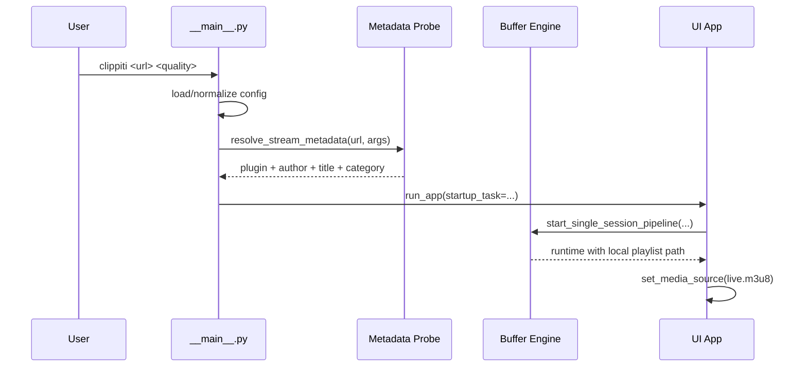
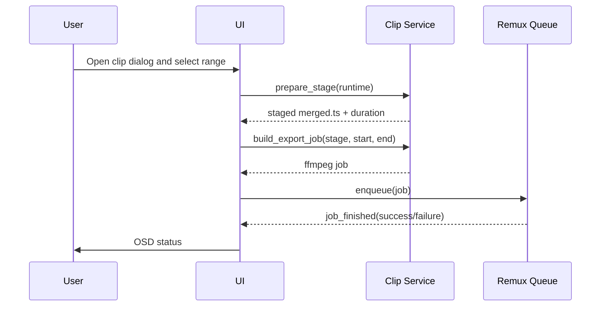
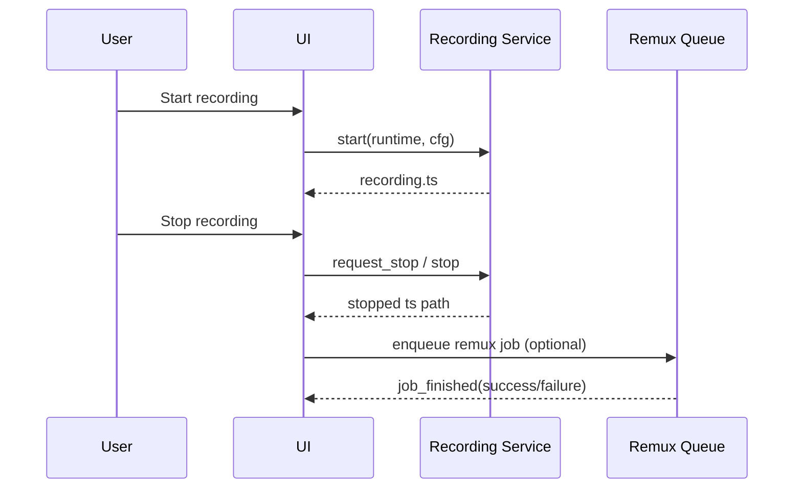
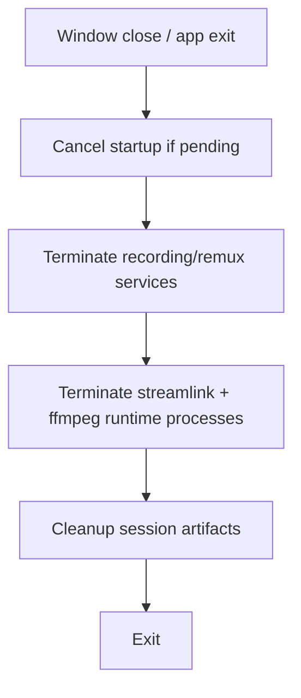

# Runtime Workflows

This document summarizes the main application workflows.

## 1. Startup and Playback

```mermaid
sequenceDiagram
    participant User
    participant Main as __main__.py
    participant Probe as Metadata Probe
    participant Buffer as Buffer Engine
    participant UI as UI App

    User->>Main: clippiti <url> <quality>
    Main->>Main: load/normalize config
    Main->>Probe: resolve_stream_metadata(url, args)
    Probe-->>Main: plugin + author + title + category
    Main->>UI: run_app(startup_task=...)
    UI->>Buffer: start_single_session_pipeline(...)
    Buffer-->>UI: runtime with local playlist path
    UI->>UI: set_media_source(live.m3u8)
```

## 2. Clip Export

```mermaid
sequenceDiagram
    participant User
    participant UI
    participant Clip as Clip Service
    participant Queue as Remux Queue

    User->>UI: Open clip dialog and select range
    UI->>Clip: prepare_stage(runtime)
    Clip-->>UI: staged merged.ts + duration
    UI->>Clip: build_export_job(stage, start, end)
    Clip-->>UI: ffmpeg job
    UI->>Queue: enqueue(job)
    Queue-->>UI: job_finished(success/failure)
    UI->>User: OSD status
```

## 3. Recording and Optional Remux

```mermaid
sequenceDiagram
    participant User
    participant UI
    participant Rec as Recording Service
    participant Queue as Remux Queue

    User->>UI: Start recording
    UI->>Rec: start(runtime, cfg)
    Rec-->>UI: recording.ts
    User->>UI: Stop recording
    UI->>Rec: request_stop / stop
    Rec-->>UI: stopped ts path
    UI->>Queue: enqueue remux job (optional)
    Queue-->>UI: job_finished(success/failure)
```

## 4. Shutdown

```mermaid
flowchart TD
    A[Window close / app exit] --> B[Cancel startup if pending]
    B --> C[Terminate recording/remux services]
    C --> D[Terminate streamlink + ffmpeg runtime processes]
    D --> E[Cleanup session artifacts]
    E --> F[Exit]
```
